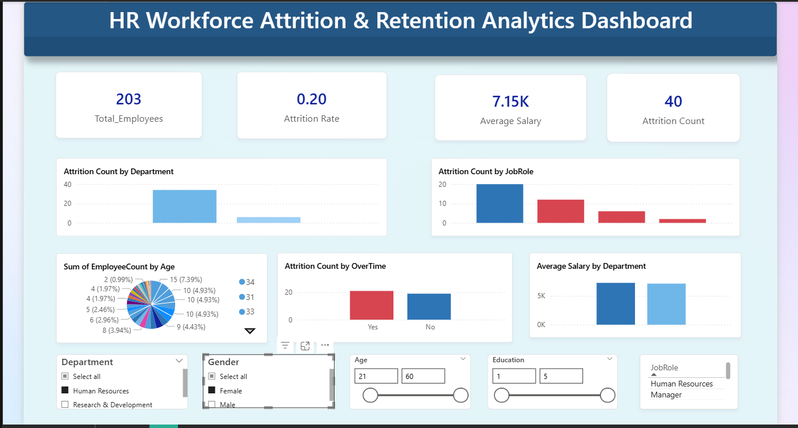

# HR Workforce Attrition & Retention Analytics Dashboard

## Project Overview
Employee attrition is a critical challenge faced by organizations, impacting productivity, operational efficiency, and recruitment costs. This project presents an interactive **HR Analytics Dashboard developed using Microsoft Power BI** to analyze workforce data and uncover key factors influencing employee attrition.

The dashboard enables HR teams and business stakeholders to gain valuable insights into workforce trends, employee demographics, salary distribution, and department-wise attrition patterns. These insights support data-driven decision-making aimed at improving employee retention and organizational performance.

---

## Objectives
The primary objectives of this project are:

- Analyze employee attrition patterns across departments and job roles  
- Identify workforce trends and potential risk areas  
- Evaluate the relationship between overtime, salary, and attrition  
- Provide an interactive dashboard for HR decision-making  
- Support organizations in developing effective employee retention strategies  

---

## Tools & Technologies Used

| Tool | Purpose |
|-----|--------|
| **Microsoft Power BI** | Data visualization and dashboard creation |
| **Power Query** | Data cleaning and transformation |
| **DAX (Data Analysis Expressions)** | Data modeling and KPI calculations |
| **HR Analytics Dataset** | Workforce data for analysis |

---

## Key Features

The dashboard includes the following analytical components:

- **Total Employees KPI**
- **Attrition Rate Analysis**
- **Attrition by Department**
- **Attrition by Job Role**
- **Average Salary by Department**
- **Attrition by Overtime**
- **Employee Age Distribution**
- **Interactive Filters (Department, Gender, Age, Education, Job Role)**

These visualizations allow users to dynamically explore HR data and uncover meaningful insights.

---

## Dashboard Insights

The HR Analytics Dashboard helps identify:

- Departments with higher employee attrition
- Job roles with increased turnover risk
- Impact of overtime on employee retention
- Salary distribution across departments
- Workforce demographic patterns

These insights help HR teams implement targeted strategies to improve employee satisfaction and retention.

---

## Dataset

The project utilizes the **HR Employee Attrition Dataset**, which includes key employee attributes such as:

- Age
- Department
- Job Role
- Salary
- Overtime Status
- Education Level
- Attrition Status

---

## Dashboard Preview

---

## Future Improvements

Potential enhancements for this project include:

- Implementing **predictive attrition analysis using machine learning**
- Integrating **real-time HR databases**
- Developing **employee performance analytics dashboards**
- Expanding analytics with **advanced workforce forecasting**

---

## Author

**Gireesh Boggala**  
Aspiring Data Analyst | Power BI Developer  

---

